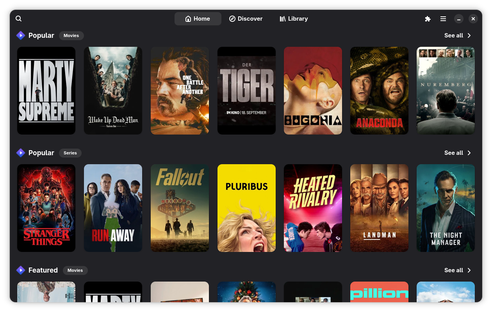

<div align="center">


# Losange
A simple [Stremio](https://stremio.com) client for [GNOME](https://www.gnome.org/) made with [Relm4](https://github.com/Relm4/Relm4)



</div>

> [!NOTE]
> This is a work in progress, missing features and bugs to be expected.

## Installation

You can find all the package files in the [Releases](https://github.com/tymmesyde/Losange/releases) section of this repository

### Fedora
```bash
dnf copr enable tymmesyde/Losange
dnf install Losange
```

### Nix/NixOS

#### Nixpkgs (Recommended)

You can install the latest stable release using the `losange` package from [Nixpkgs](https://search.nixos.org/packages?query=losange).

You can also try out Losange without installing:

```bash
nix run nixpkgs#losange
```

#### Flake

You can install the latest development ("tip") version using the Flake from Losange's source repository.

First, add the following to your Flake inputs:

```nix
{
  inputs.losange.url = "github:tymmesyde/Losange";
  inputs.losange.inputs.nixpkgs.follows = "nixpkgs";
}
```

Then install the package using `inputs.losange.packages.${pkgs.stdenv.hostPlatform.system}.losange`.

Alternatively, you can add the following overlay and then just install using `pkgs.losange`:

```nix
{
  nixpkgs.overlays = [ inputs.losange.overlays.default ];
}
```

You can also try out Losange without installing:

```bash
nix run github:tymmesyde/Losange
```

## Development

```
git clone --recurse-submodules https://github.com/tymmesyde/Losange
```

### Prerequisites

#### Fedora
```bash
dnf install gtk4-devel libadwaita-devel mpv-devel
cargo install cargo-generate-rpm
```

#### Nix

The Nix build environment can be accessed like any other [Nix dev shell](https://nix.dev/tutorials/first-steps/declarative-shell.html), via the `nix develop` command (or `nix-shell` if you don't have the [nix-command experimental feature](https://nix.dev/manual/nix/2.24/development/experimental-features#xp-feature-nix-command) enabled).

After setting up the Nix environment, you can run the same `cargo` commands as on other distributions or you can build the package with Nix by running:

```bash
nix build .#losange
```

The binary would then be located under `./result/bin/`.

#### Ubuntu
```bash
apt install libgtk-4-dev libadwaita-1-dev libmpv-dev
cargo install cargo-deb
```

#### Flatpak
```bash
dnf install flatpak-builder
flatpak install -y org.gnome.Sdk//50
flatpak install -y org.gnome.Platform//50
flatpak install -y org.freedesktop.Sdk.Extension.rust-stable//25.08
flatpak install -y org.freedesktop.Platform.ffmpeg-full//24.08
python3 -m pip install toml aiohttp
```

### Building

#### Fedora
```bash
cargo build --release
strip -s target/release/losange
cargo generate-rpm
#> target/generate-rpm/*.rpm
```

#### Nix

```bash
# the binary will be located under ./result/bin/
nix build .#losange
```

#### Ubuntu
```bash
cargo build --release
cargo deb
#> target/debian/*.deb
```

#### Flatpak
```bash
./build-aux/flatpak/build.sh
#> build-aux/flatpak/*.flatpak
```
