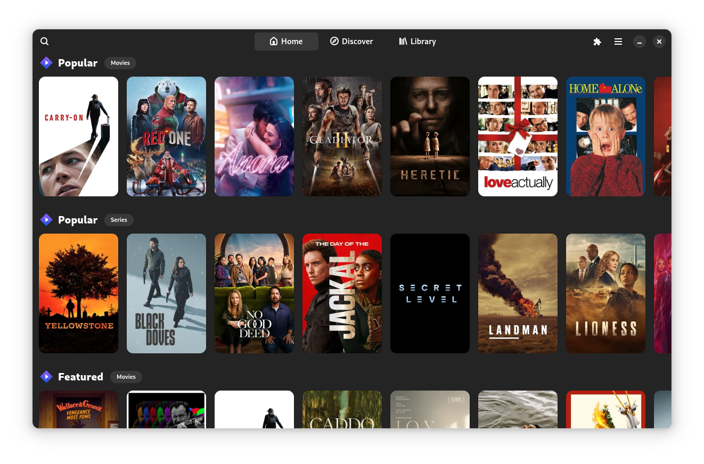

<div align="center">


# Losange
A simple [Stremio](https://stremio.com) client for [GNOME](https://www.gnome.org/) made with [Relm4](https://github.com/Relm4/Relm4)



</div>

> [!NOTE]  
> This is a work in progress, missing features and bugs to be expected.

## Installation

You can find all the package files in the [Releases](https://github.com/tymmesyde/Losange/releases) section of this repository

### Fedora
```bash
dnf copr enable tymmesyde/Losange
dnf install Losange
```

## Development

```
git clone --recurse-submodules https://github.com/tymmesyde/Losange
```

### Prerequisites

#### Fedora
```bash
dnf install gtk4-devel libadwaita-devel gstreamer1-devel gstreamer1-plugins-base-devel
cargo install cargo-generate-rpm
```

#### Ubuntu
```bash
apt install libgtk-4-dev libadwaita-1-dev libgstreamer1.0-dev libgstreamer-plugins-base1.0-dev
cargo install cargo-deb
```

#### Flatpak
```bash
dnf install flatpak-builder
flatpak install -y org.gnome.Sdk//47
flatpak install -y org.gnome.Platform//47
flatpak install -y org.freedesktop.Sdk.Extension.rust-stable//24.08
python3 -m pip install toml aiohttp
```

### Building

#### Fedora
```bash
cargo build --release
strip -s target/release/losange
cargo generate-rpm
#> target/generate-rpm/*.rpm
```

#### Ubuntu
```bash
cargo build --release
cargo deb
#> target/debian/*.deb
```

#### Flatpak
```bash
./build-aux/flatpak/build.sh
#> build-aux/flatpak/*.flatpak
```
